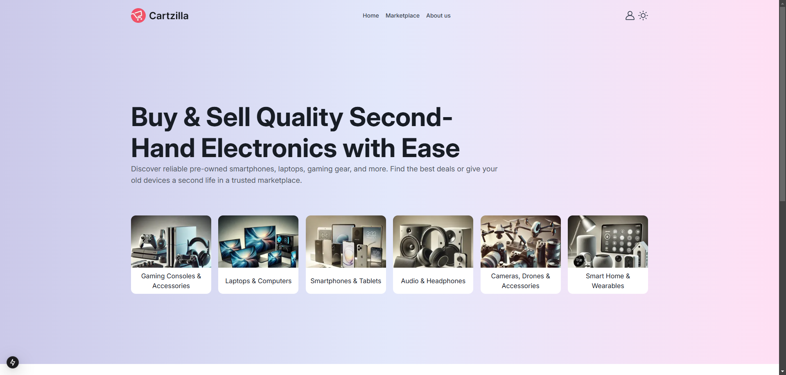
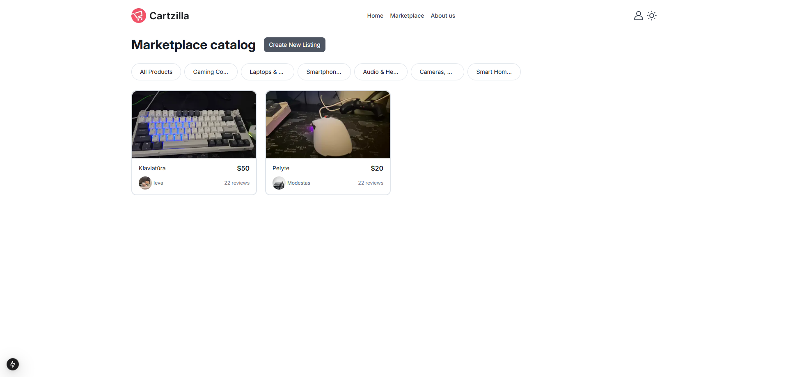
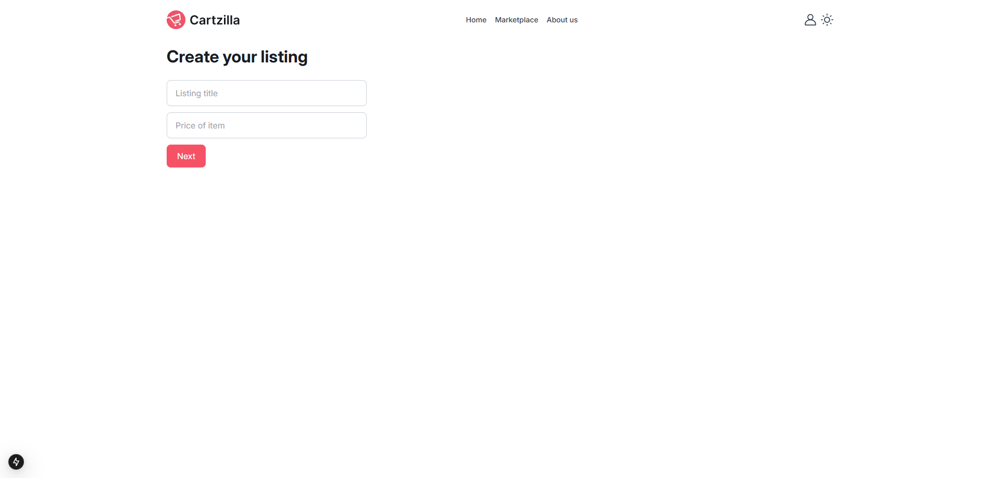
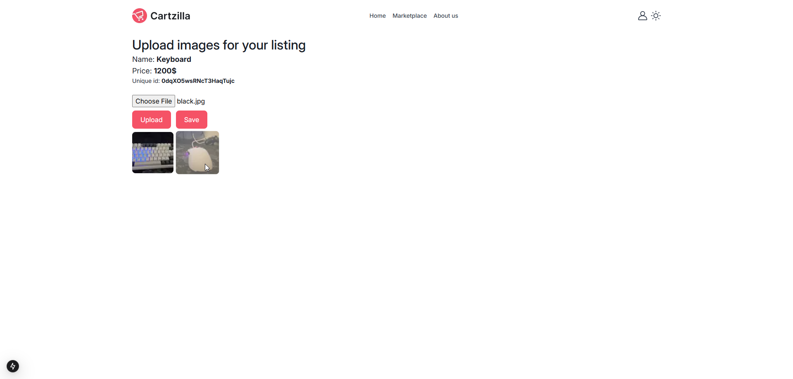
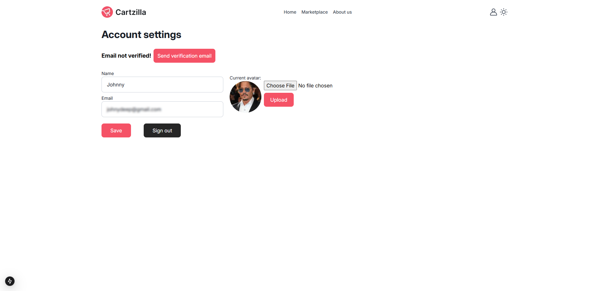

# 🚀 Modiz Mini-marketplace

Prototype of marketplace build with next.js, tailwindcss, firebase.

## 🛠️ Technical Stack:

- **Frontend:** React.js, Next.js, Tailwind CSS
- **Backend:** Firebase

## 📌 Features

- Sign up / Sign in
- Account settings
- Upload listings with name, price, images
- View listings
- Dark/Light modes

## 📃 Installation & Usage

1. Clone the repo:

   ```bash
   git clone https://github.com/meModiz/mini-marketplace.git
   ```

2. Install dependencies:

   ```bash
   pnpm install
   ```

3. Run dev server

   ```bash
   pnpm dev
   ```

### 📸 Project Screenshots

<a href="./project_showcase_images/1.png"></a>
<a href="./project_showcase_images/2.png"></a>
<a href="./project_showcase_images/3.png"></a>
<a href="./project_showcase_images/4.png"></a>
<a href="./project_showcase_images/5.png"></a>
